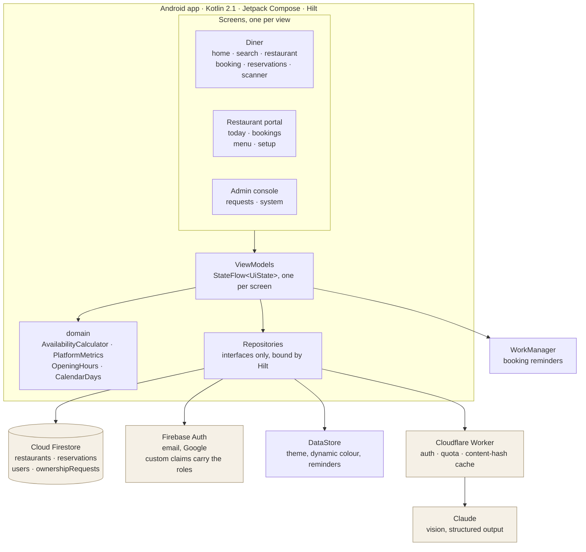
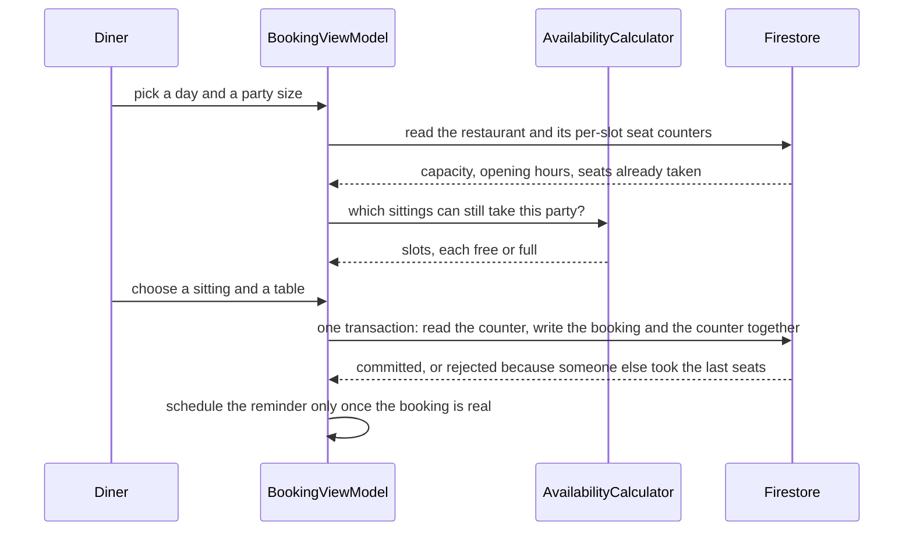
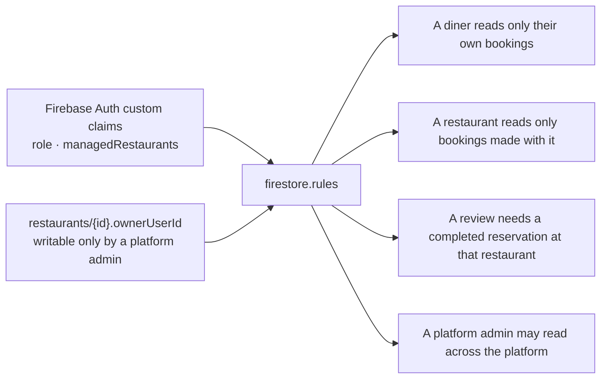

# KulaPro

A restaurant reservation app for Android. Diners find somewhere with a real table free
tonight and book it; restaurants see what their room is actually doing and manage the
bookings as they land; the people running the platform decide who gets to manage a
restaurant and watch whether the service is working at all.

The promise the app has to keep is that a slot it offers is a slot the restaurant can
serve. Availability is counted against the room's capacity, walk-ins included, so nothing
is double booked and an owner's dashboard reflects the evening rather than only the part of
it that came through the app.

---

## The three views

One APK, three separate views of it. Which ones a person sees comes from their signed Firebase
Auth claims, so the app never shows a door the security rules would refuse to open.

| View | Who | What it is for |
| --- | --- | --- |
| **Diner** | everyone, signed in or not | Browse and search restaurants, see who has a table tonight, keep favourites, read a menu, book a sitting and pick a table, get a reminder, review a visit, scan a dish for its nutrition |
| **Restaurant** | whoever the platform has put in charge of that restaurant | Tonight's covers and occupancy, the bookings list with confirm, seat, complete and no-show, walk-ins, menu and nutrition data, capacity, sitting length and opening hours, the public listing |
| **Platform** | a platform admin | Ownership requests, approved or rejected with a reason, and the system view: listings, unclaimed listings, registered diners, covers and bookings over 7, 30 or 90 days, cancellation and no-show rates, and the hours the whole platform is busy |

Browsing needs no account. The sign-in gate sits at the action, not at the front door, so a
guest can look around and is only asked to sign in when they try to book.

Restaurant hosting and the admin console are entered from Profile, alongside settings and
about. The diner's tab bar stays about finding somewhere to eat.

---

## Architecture



**Nothing above the repository layer names Firebase.** Repositories are interfaces bound to
Firestore implementations in two Hilt modules, split along the same line the app is:
`RepositoryModule` for what a diner touches, `ManagementModule` for the restaurant and
platform sides. Swapping a backend in, or a fake for a test, is a change to those two files.

**Screen logic lives in view models, not in composables.** Each screen has a `StateFlow` of
one immutable `UiState`, with `isLoading`, the data, and an error, so a screen can express
loading, empty and failure rather than only success. That is what makes the logic testable:
a composable holding its own state cannot be asserted against without rendering it.

**The rules that decide things live in `domain`.** Whether a sitting is bookable, what the
platform's covers look like over a fortnight, when a restaurant is open: pure functions over
plain data, with no Android and no clock of their own, so a test fixes the time rather than
hoping the suite is not run at 22:15.

### The booking transaction



The seat counters are a public, per-slot document carrying no personal data. That is what
lets the home screen answer "who has a table tonight" with a single collection-group query
instead of one read per listing, without giving anyone sight of who is booked.

### Data

```
restaurants/{restaurantId}          world readable, written by whoever manages it
  ├── menuItems/{menuItemId}        prices and, where entered, nutrition
  ├── tables/{tableId}              the floor plan a diner picks from
  ├── slots/{startsAtSeconds}       public seat counters, no personal data
  └── reviews/{reviewId}            one per completed reservation
reservations/{reservationId}        the diner's, or the restaurant's for a walk-in
users/{userId}
  └── favourites/{restaurantId}
ownershipRequests/{requestId}       asking to run a restaurant, and the decision
nutritionCache/{sha256}             written by the scanner proxy, never by a client
```

### Who is allowed to do what



Authorisation never reads a Firestore field the user can write. The `role` field on a user
document is a display mirror; the gate is the signed claim, which a client cannot forge.
Ownership has a second source, `ownerUserId` on the restaurant document, which only a
platform admin may write: that lets an approval take effect the moment a reviewer taps it,
while still being a decision no ordinary user can make.

A review is accepted only when the referenced reservation belongs to the author, is at that
restaurant, and is `COMPLETED`. Fake reviews are structurally hard here rather than merely
discouraged.

### The dish scanner

Point the camera at a plate and get an estimate of what it is and what is in it.

The Anthropic API key never enters the APK, because a key shipped in an app is extractable
in minutes. Requests go to a Cloudflare Worker in `worker/`, which verifies the caller's
Firebase ID token, checks a content-hash cache, enforces a per-user daily quota, and only
then calls the model. A menu item that already carries nutrition skips the model entirely
and reads from Firestore, so what a restaurant types into its menu directly reduces what the
app costs to run.

Every result is labelled an estimate, states the portion it was calculated against, and
shows a confidence level. The app makes no allergen claims and no medical ones: a picture is
not an allergen test, and anything allergen-shaped is answered with "ask the restaurant".

---

## Building it

### Requirements

- Android Studio, and JDK 21 (`compileSdk` 35, `targetSdk` 35, build tools 36.0.0)
- A Firebase project with Cloud Firestore and Authentication enabled
- Node 20, for the seed scripts, the rules tests and the scanner worker
- A Cloudflare account and an Anthropic API key, only if you want the dish scanner

### Steps

1. Clone and open in Android Studio, then let Gradle sync.
   ```
   git clone https://github.com/10krhinooo/KulaPRO.git
   ```
2. Put your own `app/google-services.json` in place. The key in it identifies the project
   rather than authorising anything, which is why it is committed; the security rules are
   what actually protect the data.
3. Create `local.properties`, which is deliberately not in version control. `SCANNER_URL`
   is optional and an empty value is a supported state: the app builds and simply does not
   offer to scan, so a checkout with no Cloudflare account works.
   ```properties
   sdk.dir=/path/to/Android/Sdk
   SCANNER_URL=https://your-worker.workers.dev
   ```
4. Deploy the rules and indexes, and seed some restaurants. The seed script uses the Admin
   SDK, which bypasses the security rules, so run it with credentials you trust.
   ```
   firebase deploy --only firestore:rules,firestore:indexes
   GOOGLE_APPLICATION_CREDENTIALS=key.json node scripts/seed-firestore.js
   ```
   It is idempotent: restaurants have fixed ids, so re-running updates rather than
   duplicating. Point `FIRESTORE_EMULATOR_HOST` at a local emulator instead to keep it off a
   real project entirely.
5. The first platform admin has to be minted out of band, because the role that grants every
   other role cannot be granted from inside the app.
   ```
   export ACCESS_TOKEN=$(gcloud auth print-access-token)
   node scripts/set-reviewer.js you@example.com
   ```
   The claim reaches the app on the next sign-in, so sign out and back in once.

### The scanner worker

```
cd worker
npm install
npx wrangler secret put ANTHROPIC_API_KEY
npx wrangler deploy
```
Then put the deployed URL in `local.properties` as `SCANNER_URL`. `worker/README.md` has the
detail.

---

## Quality gates

Every pull request runs five jobs. Requiring all five before a merge is a branch protection
setting on `main` rather than something the repository can enforce by itself.

| Job | What it runs |
| --- | --- |
| Build | `./gradlew assembleDebug`, and publishes the debug APK as an artifact |
| Unit tests and coverage | `testDebugUnitTest koverXmlReport koverVerify` |
| Lint and static analysis | `lintDebug detekt` |
| Firestore security rules | the rules suite against the emulator, so no real project is touched |
| Scanner worker | `typecheck` and the worker's own tests, with the model and KV faked |

Coverage is gated at **90% of lines, over the layers that carry logic**: `domain`, `util`,
the settings and scanner data layers, every `ViewModel` and every `UiState`. Generated Hilt
and serialization code, `BuildConfig`, `R`, the theme, and `@Composable` bodies are excluded,
each with its reason written next to it in `app/build.gradle.kts`. Measuring a 90% bound over
composable bodies would mean writing render-and-assert-nothing tests to reach it, which is a
number you cannot trust; composables are covered by Compose UI tests instead.

---

## Project layout

```
app/src/main/java/com/example/kulapro/
  data/model         Firestore documents as data classes
  data/repository    repository interfaces and their Firestore implementations
  data/scanner       the dish scanner's client and its wire types
  data/settings      DataStore-backed preferences
  di                 Hilt modules
  domain             availability, platform metrics, opening hours, day boundaries
  feature/…          one package per area: booking, home, reservations, owner, admin, …
  pages              the remaining screens, still being moved into feature packages
  ui/components      the shared widgets screens are built from
  ui/theme           colour, type, shape and motion tokens
config/detekt.yml    static analysis rules
firestore.rules      who may read and write what
rules-tests/         the emulator suite that proves it
scripts/             seeding and the one-off role scripts
worker/              the Cloudflare Worker behind the dish scanner
```

## Licence

See [LICENSE](LICENSE).
